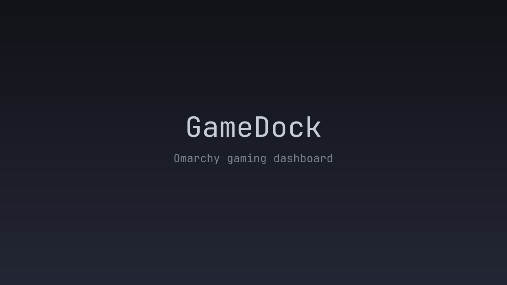

# GameDock

**Your games, one Omarchy-native launcher.**

GameDock is an Omarchy bar plugin that brings games from Steam, Heroic,
RetroArch, and RPCS3 into one compact dashboard. Search, filter, sort, favorite,
and launch games directly without opening a launcher UI first.



## Features

- 🎮 Unified game launcher
- 🔎 Fast in-memory search
- 🎛️ Launcher filtering
- ↕️ Natural, Recent, A–Z, and Launcher sorting
- ⭐ Persistent favorites
- 🕘 Recently played games
- 🖼️ Local and remote artwork with glyph fallback
- ⌨️ Keyboard navigation
- 🖱️ Mouse interaction
- 🪟 Native Omarchy popout integration
- 📚 Large-library scrolling
- 🚀 Direct launching through supported launchers

## Supported Launchers

| Launcher | Detection | Launching | Artwork |
|---|---|---|---|
| Steam | Installed library metadata | Steam game URI | Local Steam grid artwork when available |
| Heroic | Epic, GOG, and Amazon metadata | Heroic launch URI | Local Heroic icons plus optional HTTPS `art_square` artwork |
| RetroArch | Playlists and history | Core plus ROM path | Launcher glyph fallback |
| RPCS3 | `games.yml` | RPCS3 `--no-gui` launch | Local `ICON0.PNG` when available |

Steam may show an empty library until Steam is logged in. Artwork availability
depends on the metadata and local files provided by each launcher.

## How It Works

GameDock scans supported launchers into a local cache, presents the results in
an Omarchy-native panel, and applies search, launcher filtering, and sorting in
memory. Selecting a game launches it through its native launcher or command.

Runtime data is stored outside the repository in the Omarchy state directory.

## Install

Install directly through the Omarchy plugin manager:

```bash
omarchy plugin add https://github.com/prathamesh913/gamedock.git --enable --yes
```

To move the widget to another bar section:

```bash
omarchy bar move io.github.prathamesh913.gamedock --section right
```

## Requirements

- Omarchy with Quickshell plugin support
- Python 3 for launcher scanning
- `curl` is optional and is used only for remote artwork downloads

GameDock does not require network access to browse local data or launch games.
If `curl` is unavailable, or a remote artwork request fails, GameDock continues
working and uses the launcher glyph fallback.

## Usage

| Action | Input |
|---|---|
| Open or close GameDock | Click the GameDock bar icon |
| Refresh launcher data | Middle- or right-click the bar icon |
| Activate search | Press `/` or click the search field |
| Edit search | Type in the active search field |
| Navigate games and controls | Arrow keys, `h`/`j`/`k`/`l`, or mouse |
| Change launcher or sort | Click a chip, or focus it and press Enter/Space |
| Launch a game | Click it, or focus it and press Enter/Space |
| Toggle a favorite | Click the star, or focus it and press Enter/Space |
| Clear search / close | Escape |
| Switch bar panels | Tab / Shift+Tab |

## Artwork

Local artwork is preferred whenever it is available. Heroic can also provide
remote square artwork, which GameDock fetches lazily for visible or nearby
games and caches locally at:

```text
~/.local/state/omarchy/gamedock/art/
```

Cached artwork is reused across shell restarts. Remote artwork URLs must use
HTTPS, and invalid downloads are rejected before they are cached. When artwork
is missing, unavailable, invalid, or cannot be downloaded, GameDock falls back
to the launcher's glyph.

## Privacy and Network Behavior

GameDock does not need network access to browse locally cached game data or
launch games. Network requests are limited to optional remote artwork supplied
by supported launcher metadata. Those artwork URLs must use HTTPS. If remote
artwork is unavailable, the rest of GameDock continues to work offline.

## Runtime Data

| Path | Purpose |
|---|---|
| `~/.local/state/omarchy/gamedock/cache.json` | Scanned launcher and game data |
| `~/.local/state/omarchy/gamedock/art/` | Validated cached remote artwork |
| `~/.local/state/omarchy/settings/gamedock.json` | Persistent favorite IDs |

These files are created and maintained automatically. They are not part of the
Git repository.

## Current Limitations

- Supported launchers are currently Steam, Heroic, RetroArch, and RPCS3.
- Controller navigation is not available yet.
- Launch failure feedback is limited.
- Current testing through 1000 synthetic games did not show a meaningful need
  for virtualized list rendering; very large real-world libraries may still
  benefit from it in the future.

## Roadmap

Possible future work includes:

- Controller navigation
- Additional launcher integrations
- More visible launch failure feedback
- Automated tests and CI
- Further polish based on real-world usage

## Contributing

Issues, fixes, and improvements are welcome. Contributions should preserve
Omarchy-native interaction patterns, avoid modifying Omarchy system files, and
keep GameDock self-contained. Run the validation commands below before
submitting changes, and see `docs/GAMEDOCK_PROGRESS.md` for architecture and
development history.

## Development Validation

```bash
qmllint -I $OMARCHY_PATH/shell Panel.qml BarWidget.qml
omarchy plugin validate .
python3 -m py_compile scan.py
```

## License

GameDock is released under the [MIT License](LICENSE).

## Status

**GameDock v1**

The current release provides a stable Omarchy-native dashboard for supported
launchers, with search, filtering, sorting, favorites, artwork, direct
launching, and large-library scrolling.
